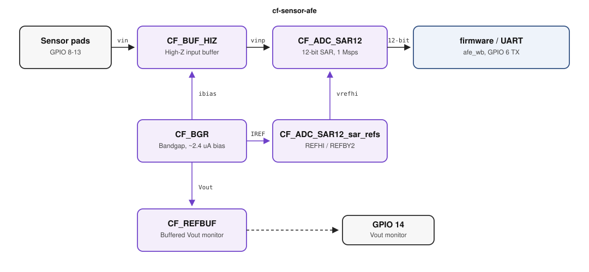

<div align="center">


[](https://opensource.org/licenses/Apache-2.0)
[](https://platform.chipfoundry.io/marketplace)

</div>

# cf-sensor-afe

ChipFoundry **sensor analog front-end** reference application on Caravel.
It is the first catalog composition that takes a high-impedance sensor,
conditions it, digitizes it, and hands a 12-bit code to on-chip firmware.

<div align="center">

</div>

## Application

Most SKY130 digital SoCs stop at GPIO. Sensing still needs a discrete
instrumentation amp, a SAR or sigma-delta ADC, a bandgap, and a reference
buffer — four packages, board parasitics, and a reference that does not
track the converter. This project puts that chain on the same die as the
RISC-V management CPU so a product team can evaluate mixed-signal Caravel
without first becoming analog-layout experts.

**What it does.** Differential, high-Z pads (GPIO 8–13) enter `CF_BUF_HIZ`.
The buffer output is the SAR `vinp`. `CF_BGR` supplies the ~2.4 µA bias
and a 1.2 V bandgap; `CF_ADC_SAR12_sar_refs` makes `REFHI` / `REFBY2` for
the converter; `CF_REFBUF` brings a copy of `Vout` to GPIO 14 so the
reference can be monitored without loading the SAR. At 18 MHz `user_clock2`
the ADC is specified at 1 Msps, 12 bits — fast enough for multiplexed
industrial channels, battery and rail monitoring, and control loops, not a
metering-grade 20-bit delta-sigma.

Firmware on the management SoC owns power-down, trim, and framing through
`afe_wb`, a synthesized Wishbone CSR hardened as its own macro and instanced
in the elaborated wrapper. The eval image writes `CTRL`, pulses `sof`, and
prints the 12-bit code on UART TX (GPIO 6). Caravel Logic Analyzer pins
are unused.

**Where it is used.** The same blocks appear in battery IoT nodes, factory
0–10 V / bridge / thermocouple front-ends, HVAC and agricultural sensors,
and any board that today ships an MCU plus an external AFE. High-Z inputs
matter when the sensor cannot drive 50 Ω PCB traces; on-chip buffering
keeps that node short. An on-die bandgap (industrial range on the BGR
datasheet, −40 °C to 100 °C) is what makes the code repeatable across
shuttles and temperature instead of tracking a noisy pad.

**Why ChipFoundry ships it as a reference app.** Characterization vehicles
prove one IP. Integrators need a wired example: shared analog supplies,
Wishbone CSR, GPIO analog defaults, PDN wrap `vpwr`/`vgnd`, and firmware that
actually converts. `cf-sensor-afe` is that example for the analog catalog.
Tapeout still substitutes protected analog GDS into the `*_core` leaves;
public views stay pin-accurate abstracts.

This drop is not a complete wireless sensor SoC (no radio, no flash, no
LDO). It is the analog acquisition island those products share. Teams
extend it with catalog digital IP (UART/SPI/I2C, timers, SRAM) or keep
Caravel’s management SoC and treat the AFE as a co-processor.

## Catalog IPs

| IP | Version | Role |
| --- | --- | --- |
| [CF_BUF_HIZ](https://github.com/chipfoundry/CF_BUF_HIZ) | 0.2.0 | Sensor input buffer |
| [CF_ADC_SAR12](https://github.com/chipfoundry/CF_ADC_SAR12) | 0.2.2 | 12-bit SAR + wrapped `sar_refs` |
| [CF_BGR](https://github.com/chipfoundry/CF_BGR) | 0.2.3 | Bandgap bias / 1.2 V reference |
| [CF_REFBUF](https://github.com/chipfoundry/CF_REFBUF) | 0.2.2 | Buffered `Vout` monitor |

Install from the project root (private GitHub; `ipm` prefers `GITHUB_TOKEN`):

```bash
export GITHUB_TOKEN="$(env -u GITHUB_TOKEN gh auth token)"
ipm install-dep --include-drafts --local-file ip/catalog.json
```

`ip/` is gitignored except `catalog.json` and `dependencies.json`. Public
wrap/core Verilog is also copied to `verilog/gl/` so platform precheck
(clone only, no `ipm install`) can run LVS.

## On-chip analog

Chip PDN is Caravel 1.8 V user supply: `vccd1`/`vssd1` → wrap `vpwr`/`vgnd`
on every macro. Analog nets stay on-chip:

| Net | From | To |
| --- | --- | --- |
| `afe_vout` | `CF_BUF_HIZ.vout` | `CF_ADC_SAR12.vinp` |
| `afe_ibias` | `CF_BGR.ibg_2p375uA` | HIZ `ibias`, SAR `ibias2p5u`, `sar_refs` `IREF_*` |
| `afe_vref` | `CF_BGR.Vout` | `CF_REFBUF.ref_1v2` |
| `afe_nbias` | `CF_BGR.ibg_3uA` | `CF_REFBUF.nbias` |
| `afe_refhi` | `sar_refs.REFHI` | SAR `vrefhi` |
| `afe_refby2` | `sar_refs.REFBY2` | SAR `refby2` |

`user_project_wrapper` is **elaborated**, not synthesized: macro instances
and wiring only (no taps, stdcell rails, or tie cells).

West-edge `sar_refs` controls use a local LEF overlay (taller met1/met2, no
fake met3) so OpenLane can access vendor-skinny pads. GDS and PDN still come
from the 0.2.2 wrap.

## GPIO

`analog_io[N]` is Caravel GPIO N+7. GPIO 7–29 and 31–34 are user analog
at power-on. GPIO 30 is unused (`mgmt_input_nopull`); `analog_io[23]` is
unconnected. Analog pads are held Hi-Z by `afe_wb` (`io_oeb=1`, `io_out=0`).

| GPIO | `analog_io` | Use |
| --- | --- | --- |
| 5 | — | UART RX (`mgmt_input_nopull`) |
| 6 | — | UART TX after firmware (`mgmt_input_nopull` at reset) |
| 7 | 0 | BGR `vb2_fast` |
| 8–13 | 1–6 | HIZ sensor inputs `vinp_p` … `vinn_na` |
| 14 | 7 | REFBUF `out` / `ch1` / `ch2` (monitor + feedback) |
| 15 | 8 | REFBUF `ng` / `vpwre` |
| 16–26 | 9–19 | HIZ analog biases `vbpt` … `vbptd` |
| 27 | 20 | SAR `vinm` |
| 28 | 21 | `sar_refs.refout` |
| 29 | 22 | SAR `vreflo` |
| 30 | 23 | Unused (`mgmt_input_nopull`) |
| 31 | 24 | BGR `dft_curr_in` |
| 32–34 | 25–27 | Shared analog `vdda`, `vssa` (+ `vssa_shield`), `VPUMP` |
| 35–37 | — | Unused (`mgmt_input_nopull`) |

GPIO 0–4 are Caravel system pins.

## Analog control vector

`analog_ctrl[122:0]` bit indices match the original LA map. Caravel
`la_data_in` / `la_data_out` / `la_oenb` are unconnected.

| Bit | Use |
| --- | --- |
| 0–6 | HIZ power-down / boost |
| 8–52 | SAR power-down, framing, trim, DFT |
| 10 | SAR `reset_n` (must be 1) |
| 11 | SAR `sof` |
| 15 | `enable_hv` (shared with `sar_refs`) |
| 53–63, 108–122 | `sar_refs` mux / buffer enables |
| 64–97 | BGR trim, mux, pd, `en_startb` |
| 104–107 | REFBUF `pd`, `switchon`, `boost`, `ch_cont` |

`user_clock2` is SAR `refclk`.

See `verilog/rtl/user_project_wrapper.v` for the full pin list.

## Harden

```bash
source venv/bin/activate
make -C openlane librelane-venv
cf harden user_project_wrapper
```

This branch uses official LibreLane **3.0.13** (native analog NDR). Recreate
`openlane/.venv` with the Makefile target above. Do not run
`cf setup --only-openlane --overwrite`; that reinstalls shuttle pin CI2511
(LibreLane 2.4.6).

OpenLane config is `openlane/user_project_wrapper/config.json`. Analog nets
`afe_*` and `analog_io*` use `ANALOG_WIDE` NDR (0.42 µm met2–met4; DRT tapers at skinny analog pins).
There is no customer `pdn_cfg.tcl`; default LibreLane PDN plus
`PDN_MACRO_CONNECTIONS` ties each wrap `vpwr`/`vgnd` to `vccd1`/`vssd1`.

## Wishbone CSR (`afe_wb`)

`afe_wb` is a 400 µm digital hard macro (`u_afe_wb` at the south-west
Wishbone pins, analog row north). Orientation `FS` puts Wishbone on south
and `analog_ctrl` on east. Analog control indices match the original LA map.

Harden the CSR by itself, then the wrapper:

```bash
cf harden afe_wb
cf harden user_project_wrapper
```

| Offset | Name | Access |
| --- | --- | --- |
| 0x00 | `ID` | RO `0xAFE00001` |
| 0x04 | `CTRL` | RW `reset_n`, `sof`, `pd`, `pd_ana`, `enable_hv`, `hiz`, `iso_en`, `next` |
| 0x08 | `STATUS` | RO `data_out[11:0]`, `eof` |
| 0x0C | `HIZ` | RW HIZ power-down / boost |
| 0x10 | `SAR_CFG` | RW sample width, resolution, cap trim, clocks |
| 0x14 | `SAR_DFT` | RW scan / DFT |
| 0x18 | `BGR` | RW trim / mux / pd |
| 0x1C | `REFBUF` | RW buffer enables; bits 4–5 are BGR `finetune` / `en_startb` |
| 0x20 | `REFS0` | RW `vref`, `PWR_CTRL_VREF`, `muxsarref`, `EN_RESVDA` |
| 0x24 | `REFS1` | RW `S_LV` and remaining `sar_refs` enables |

Product firmware (`User_enableIF()` required):

```c
if (USER_readWord(AFE_ID) != 0xAFE00001)
    /* fail */;
USER_writeWord(AFE_CTRL_RESET_N | AFE_CTRL_ENABLE_HV, AFE_CTRL);
USER_writeWord(AFE_CTRL_RESET_N | AFE_CTRL_ENABLE_HV | AFE_CTRL_SOF, AFE_CTRL);
USER_writeWord(AFE_CTRL_RESET_N | AFE_CTRL_ENABLE_HV, AFE_CTRL);
while ((USER_readWord(AFE_STATUS) & AFE_STATUS_EOF) == 0)
    ;
code = USER_readWord(AFE_STATUS) & 0xFFF;
```

Word offsets are `address / 4`. PDN: `u_afe_wb vccd1 vssd1 vccd1 vssd1`.

## Firmware and RTL sim

Eval-board image: `verilog/dv/afe_uart/afe_uart.c`. Cocotb copy:
`verilog/dv/cocotb/afe_uart/`. Both talk to `afe_wb` over Wishbone.

GPIO defaults live in `.cf/project.json` and `verilog/rtl/user_defines.v`
(GPIO 7–29 and 31–34 analog; GPIO 30 unused). After `cf setup --only-cocotb` (or a host `venv-cocotb`
with `caravel_cocotb`) and `python3 verilog/dv/setup-cocotb.py …`:

```bash
cf verify afe_uart
```

RTL sim compiles `ip/CF_ADC_SAR12/verify/beh_model/*_core.v` in place of the
empty `hdl/gl/*_core.v` stubs (do not add those files to OpenLane). The
cocotb test pokes `vinp_v=1.65` / `vrefhi_v=3.3` and expects:

```
AFE ready
ID AFE00001
ADC 800
```

HIZ / BGR / REFBUF `*_core` cells stay empty blackboxes. A passing run proves
Wishbone `ID`/`CTRL`/`STATUS`, SAR `reset_n`/`sof`/`enable_hv`, the ideal converter
model, and UART TX. `cf verify --all` runs `verilog/dv/cocotb/all_tests.yaml`
(`afe_uart` only).

## Layout notes

- Customer cell `CF_<IP>`: chip PDN `vpwr` + `vgnd` only.
- Leaf `CF_<IP>_core`: pin-only abstract (empty Verilog in OpenLane; SAR has
  an ideal sim model under `verify/beh_model/`).
- `afe_wb`: digital CSR, `vccd1`/`vssd1`.
- Shared analog supplies on GPIO 32–34.
- `MAGIC_EXT_ABSTRACT_CELLS` includes the analog `_core` names. Precheck
  LVS uses the same set in `lvs/user_project_wrapper/lvs_config.json`
  `EXTRACT_ABSTRACT`, plus committed wrap/core stubs in `verilog/gl/`.
- Analog GPIO 7–34 `io_oeb`/`io_out` come from `afe_wb` (Hi-Z).
- Caravel LA ports stay on the wrapper and are unconnected.
- Wrapper antenna 48 (was 171 with LA routed); remaining nets are SAR
  `data_out` and some `wbs_*`. KLayout DRC 0, LVS unique.

## References

- [Caravel datasheet](https://github.com/chipfoundry/caravel/blob/main/docs/caravel_datasheet_2.pdf)
- [Caravel TRM](https://github.com/chipfoundry/caravel/blob/main/docs/caravel_datasheet_2_register_TRM_r2.pdf)
- [ChipFoundry Marketplace](https://platform.chipfoundry.io/marketplace)
